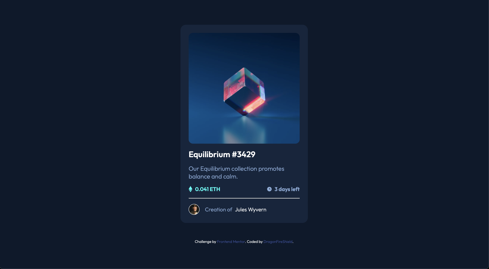

# Frontend Mentor - NFT preview card component solution

This is a solution to the [NFT preview card component challenge on Frontend Mentor](https://www.frontendmentor.io/challenges/nft-preview-card-component-SbdUL_w0U). Frontend Mentor challenges help you improve your coding skills by building realistic projects. 

## Table of contents

- [Overview](#overview)
  - [Screenshot](#screenshot)
  - [Links](#links)
- [My process](#my-process)
  - [Built with](#built-with)
  - [What I learned](#what-i-learned)
  - [Continued development](#continued-development)
  - [Useful resources](#useful-resources)
- [Author](#author)

**Note: Delete this note and update the table of contents based on what sections you keep.**

## Overview

### Screenshot

### Links

- Solution URL: [Add solution URL here](https://your-solution-url.com)
- Live Site URL: [Add live site URL here](https://your-live-site-url.com)

## My process

### Built with

- Semantic HTML5 markup
- CSS custom properties
- Flexbox
- Mobile-first workflow

### What I learned

I can display multiple elements in the same spot by wrapping them inside a container and changing the display to absolute.

### Continued development

Again some issues with images and displaying elements. Every new iteration creates new pathways for me to solve future problems.

### Useful resources

- [w3schools](https://www.w3schools.com/howto/tryit.asp?filename=tryhow_css_image_overlay_title) - Used this as a template for making an image overlay for the active state

## Author

- Frontend Mentor - [@DragonFireShield](https://www.frontendmentor.io/profile/DragonFireShield)
- Twitter - [@shieldfordragon](https://www.twitter.com/shieldfordragon)